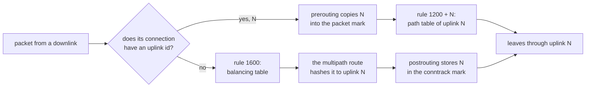
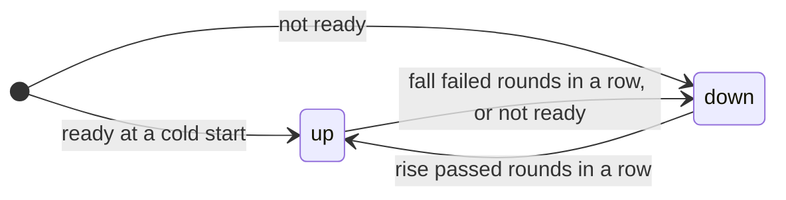

# How PolyWAN works

This page explains what PolyWAN does to a Linux router, so that an administrator can predict its behaviour, read what it installs and integrate it with the rest of the system. The contract the code is built and tested against is [SPEC.md](../SPEC.md); this page refers to its requirement identifiers (for example FR-ROUTE-3) only where a detail is worth looking up.

## The picture

A router has two kinds of interfaces that PolyWAN cares about:

- **Uplinks**, each connected to an internet provider: a fibre line, a 5G or Starlink router, a PPPoE link, an LTE stick. Each has a stable numeric `id` (1 to 63) and a `name`.
- **Downlinks**, connected to internal networks: a LAN, a DMZ, a VLAN for guests.

Everything is tracked per **path**, an (uplink, family) pair: IPv4 and IPv6 are independent, so an uplink can be healthy for IPv4 and failed for IPv6. A path is **ready** when its interface is up with carrier and has a usable source address and next hop; it is **healthy** (`up`) when its probes pass. The **active set** of a family is the set of paths that new outgoing connections are spread over.

PolyWAN does not configure interfaces, addresses or DHCP, PPP or Router Advertisement clients: that remains the job of systemd-networkd, NetworkManager, ifupdown, pppd and the kernel. It observes them through netlink and builds its routing on what they configured.

## New connections, established connections, inbound connections

The idea is the one of Fault Tolerant Router 1.x: the kernel's multipath routing chooses an uplink for each new outgoing connection, and connection marks keep every connection on the uplink it started on.

**New outgoing connections** from the downlinks (and from the router itself, see [traffic of the router](#traffic-of-the-router-itself)) are routed by the **balancing table**, which holds one multipath default route over the active set, each member with its uplink's `weight`. The kernel chooses a member by hashing the connection's addresses, protocol and ports (PolyWAN sets `fib_multipath_hash_policy = 1`, the layer-4 hash, for every family it manages). This is not round-robin, as the 1.x README described: weights split connections statistically, over many connections; one large download stays on one uplink; and two connections with the same addresses, protocol and ports go the same way while the active set does not change. Just before the first packet leaves, in nftables' postrouting hook, PolyWAN writes the id of the uplink it actually left through into the connection's conntrack mark.

**Established connections**: for every later packet, in both directions, PolyWAN copies the uplink id from the conntrack mark into the packet mark before routing (prerouting for forwarded traffic, output for the router's own). A routing rule per uplink sends packets carrying that mark to the uplink's **path table**, whose only route goes through that uplink. A connection therefore stays on its uplink for its whole life, whatever happens later to health, weights, the active set or drain.

**Inbound connections**: a new connection that arrives on an uplink, to a port forwarded to a LAN host or to a service of the router, gets that uplink's id in its conntrack mark on arrival. Its replies, from the LAN host after DNAT or from the router itself, are routed back through the same uplink, also when that uplink is not in the active set or is drained, as long as it is ready.

The path of a forwarded packet, leaving out the main bypass and policies (described below):

If the uplink of an established connection stops being ready (carrier lost, address gone) or is removed from the configuration, its packets are rejected with ICMP unreachable rather than moved to another uplink: another uplink would change the source address after NAT, and the server would not recognise the connection anyway. Connections on a failed uplink generally break and are re-established by the client, as new connections, on another uplink.

## Routing tables and rules

PolyWAN installs its own routing tables and policy routing rules, separately for each family it manages (a family is managed when at least one uplink enables it: an IPv4-only installation installs nothing for IPv6). With the default `table_base = 1000` and `rule_priority_base = 1000`, and an uplink of id `N`:

| Table | Holds a default route through | When |
|---|---|---|
| 1000 | the active set (multipath, by weight) | the active set is not empty |
| 1000 + N | uplink N | the path is ready, healthy or not |
| 1064 + N | uplink N, for policies with `fallback = "balance"` | the path is healthy and the uplink not drained |
| 1128 + N | uplink N, for policies with `fallback = "block"` | the path is healthy and the uplink not drained |

| Priority | Matches | Does |
|---|---|---|
| 1000 + N | probe packets of uplink N | look up table 1000 + N |
| 1064 | probe packets that found no route above | reject (unreachable) |
| 1100 | everything | look up `main`, ignoring its default routes |
| 1200 + N | connections pinned to uplink N | look up table 1000 + N |
| 1264 | pinned connections that found no route above (uplink not ready, or id no longer configured) | reject |
| 1300 + N | new connections of a policy for N, fallback balance | look up table 1064 + N; without a route, continue to 1600 |
| 1400 + N | new connections of a policy for N, fallback block | look up table 1128 + N |
| 1464 | new connections of a policy with fallback block that found no route above | reject |
| 1500 + N | unmarked traffic from an address of uplink N | look up table 1000 + N |
| 1564 | unmarked traffic from an uplink address that found no route above | reject |
| 1600 | everything else | look up table 1000 (balancing) |
| 1699 | everything that got this far | reject |

Each PolyWAN table holds at most one route, a default route with metric 100. A lookup that finds no route in a table continues with the next rule, and ends at the reject rule of its class or at the final one at 1699, so that nothing PolyWAN handles can leak to a table it does not own. You can see all of it with `ip rule show`, `ip -6 rule show` and `ip route show table 1001`; every rule and route carries the routing protocol `route_protocol` (default 249), which is how PolyWAN recognises its own objects.

Changes at runtime (health, drain, active set, addresses, gateways) only replace or delete routes and add or remove the `from` rules at 1500 + N and 1564; all other rules depend only on the configuration.

### The main bypass

The rule at 1100 looks up the main table but ignores its default routes (`suppress_prefixlength 0`). Every destination covered by a more specific route in `main` is therefore routed as the operating system intends, before any PolyWAN mark is consulted: connected networks, downlinks, static routes, VPN routes, routes pushed by DHCP option 121. This keeps internal and VPN traffic working, and it is why routes towards the downlinks and other internal networks must be in the main table: a downlink address configured with `noprefixroute`, or into another table, makes replies towards that network follow an uplink, and `check-config` warns about it. A VPN that installs `0.0.0.0/1` and `128.0.0.0/1` overrides PolyWAN for all traffic, by design.

The default routes in `main`, installed by DHCP clients, Router Advertisements or the administrator, stay there and are what PolyWAN reads to discover each uplink's gateway; because of the final reject rule they are never used for traffic that enters PolyWAN's rules. 1.x required a main table without default routes; 2.0 does not.

### Rules of other tools

Only rules with a priority between 1 and `rule_priority_base` and the local table's rule at priority 0 come before PolyWAN's rules. PolyWAN's guarantees do not cover traffic that such a foreign rule matches: if you add your own rules there (for example for a VPN or another routing tool), PolyWAN routes nothing of what they match. `check-config` and the daemon at startup list them in a warning. The kernel's VRF rule (`l3mdev`, priority 1000 by default) only matches traffic of VRF devices and is listed in the same warning. A rule in PolyWAN's priority range, or a route in its table range, that does not carry PolyWAN's protocol is a collision with another tool: the daemon refuses to start, and `check-config` reports it, until you move one of the two ranges.

## What PolyWAN guarantees

While PolyWAN is installed and running, for traffic of a managed family that reaches its rules:

- **Main bypass**: destinations covered by a non-default route of the main table are routed by the main table.
- **Pinning**: a connection that has been assigned an uplink is routed through that uplink for its whole conntrack lifetime, in both directions; if the uplink is not ready or no longer configured, its packets are rejected, never moved.
- **No leak**: everything else is routed by a PolyWAN table or rejected; it never uses a default route of the operating system.
- **New connections**: new forwarded connections that no policy matches, and new connections of the router that are not bound to an uplink address or an interface, use only the active set, or are rejected with ICMP unreachable when the active set is empty.
- **Inbound symmetry**: replies to a connection that arrived on an uplink leave through that uplink while it is ready.
- **Probes**: each uplink's probes leave through that uplink, with its gateway and source, whenever it is ready.
- **Non-interference**: PolyWAN uses only the 8 bits of the packet and connection marks selected by `fwmark_mask` (default `0x00ff0000`), never deletes or changes objects it does not own, never adds `drop`, `reject` or `accept` verdicts to nftables, and changes only the sysctls listed [below](#system-settings).
- **Decoupling**: notifications, hooks, API clients and metrics scrapes never delay routing decisions.

These hold from the end of installation, during reloads and partial failures (PolyWAN orders every change so that a half-applied change never breaks them), and stop when cleanup starts. While a third party has deleted PolyWAN's rules or routes they cannot hold; they hold again once PolyWAN has restored them, normally within a second. Continuity is promised only to connections whose uplink stays ready and keeps the same source address and conntrack entry.

## The active set

For each family, the active set is computed from the **candidates**: paths whose uplink has a `priority`, is not drained, and is ready.

| Situation | Active set |
|---|---|
| At least one candidate is healthy | the healthy candidates of the best (lowest-numbered) priority group that has one |
| No candidate is healthy, `all_down_policy = "ready"` (default) | the candidates of the best priority group, healthy or not |
| No candidate is healthy, `all_down_policy = "keep"` | the previous active set, restricted to the current candidates |
| No candidate, or the result above is empty | empty: new connections are rejected |

Priority groups keep a metered or slow uplink out of use until every uplink of a better group has failed. The `ready` default exists because if every uplink fails its checks at once, the probes themselves may be the problem (the probe targets may be unreachable, for example), and the best group is then still the best guess.

An uplink without `priority` never joins the active set, but everything else keeps working for it: inbound connections, probes, policies, and traffic of the router bound to its address. Use it for an uplink reserved to inbound services or to policies.

**Drain** (`polywan drain NAME`) takes an uplink out of the candidates at runtime, for maintenance: it receives no new connections, neither through balancing nor through policies (whose fallback then applies), while existing connections, inbound connections, probes and traffic of the router explicitly bound to its address or interface continue. Drain is written to the state directory before it is applied, and survives restarts and upgrades until `polywan undrain NAME` or until the uplink is removed from the configuration. Draining the last candidate of a family needs `--force`.

## Health checks

Each ready path is probed through its own interface, from its own source address, with packets marked so that the probe rules send them through the path's own table whatever the active set, the drain state or the main table say. Probes are ICMP echo (`icmp:ADDRESS`) or TCP handshakes (`tcp:ADDRESS:PORT`, for links that filter ICMP; a SYN-ACK or a reset counts as a reply), sent from inside the daemon, without external programs.

Every `interval` (default 5 s) a **round** probes all targets of the family at once, each with up to `attempts` attempts (default 2) of `timeout` each (default 1 s). A target is reachable if any attempt got a valid reply; the round passes if at least `required_reachable` targets (default 2) were reachable. A healthy path goes `down` after `fall` failed rounds in a row (default 2) and comes back `up` after `rise` passed rounds in a row (default 3). With the defaults, a silent upstream failure takes the path down within 17 s; loss of carrier or of the interface takes it down, and its routes out of the active set, within a second, without waiting for the probes.

Targets should be far away and highly available: the defaults are well-known anycast DNS resolvers of different operators. A nearby host, such as the provider's own router, is a bad target: the provider can be cut off from the rest of the internet while its router still answers, and the uplink would look healthy while it is useless. Requiring every target to answer is also a bad idea, because single probes get lost and single targets go down.

Optional **quality gates** (`max_loss`, `max_rtt`, `max_jitter`) treat a link that answers but loses too many packets or is too slow as failed. They are evaluated over the samples of the last `quality_window` rounds, so a path taken down by a gate comes back only after `rise` passed rounds and once the window no longer violates the gate. The configuration reference explains the details and the limits of the statistics shown without gates.

After a restart, a path starts in the state it had before when a health checkpoint from the same boot, less than 10 minutes old, describes it (a **warm start**), so that a restart does not briefly re-activate an uplink that was down. Otherwise (**cold start**, for example after a reboot) a ready path starts `up` and its first round decides.

## Discovery

PolyWAN follows each uplink interface by name; when the interface disappears its paths become not ready, and when an interface with the same name appears again (a PPP interface recreated by pppd, for example) discovery starts over.

- **Addresses**: every global address of the interface that is not tentative or failed duplicate address detection gets a `from` rule (priority 1500 + N) and a reject rule (1564), so that traffic of the router bound to it uses that uplink. The **source** of the path (`source = "auto"`) is one of them, preferring permanent over dynamic, primary over secondary, then the lowest; or a static address you configure.
- **Gateway** (`gateway = "auto"`): IPv4 point-to-point interfaces such as PPP need none. Otherwise PolyWAN takes the default route of the family that uses the uplink interface from the tables listed in `discovery_tables` (default `main`), choosing the lowest metric. A static `gateway` must be covered by a connected route of the interface, or declared with `gateway_onlink = true`. An IPv6 path always needs a gateway, typically the link-local address of the provider's router learnt from its Router Advertisements.
- Routes that use a single nexthop object (systemd-networkd 256 and later can install Router Advertisement routes this way) are resolved; routes that use nexthop groups are not, and a warning recommends a static `gateway`.

Discovery is driven by netlink notifications: a change of carrier, address or gateway is reflected in PolyWAN's routes within a second, and Router Advertisement lifetimes are tracked even when the kernel does not notify their refresh or expiry. A path whose routes the kernel refuses is not ready, with reason `route_install_failed`, and is retried.

## Policies

A policy sends the matching new forwarded connections through a chosen uplink: for example SMTP from the mail server through the line whose address has the right PTR record, or a VoIP phone through the low-latency line. It matches by family, input downlink, source and destination prefixes, protocol and destination port; policies are evaluated in order and the first match wins. A matching connection is pinned to whatever uplink its first packet actually used, like any other.

While the policy's uplink is not healthy or is drained, `fallback = "balance"` (the default) spreads the matching connections over the active set, and `fallback = "block"` rejects them. Policies do not apply to traffic of the router itself, and do not override the main bypass.

## NAT

For each path, `nat` chooses what happens to traffic from the downlinks leaving through the uplink:

- `masquerade`: source NAT to the uplink's current address; works with dynamic addresses, and is the IPv4 default.
- `snat`: source NAT to the static `source` address.
- `none`: no translation, for routed setups.

IPv6 has no default and must be chosen explicitly: with several providers, `none` works only if every provider routes your LAN prefix, which is rare; masquerade with a ULA prefix on the LAN gives transparent failover at the cost of end-to-end addressing. Traffic between downlinks and traffic of the router are never translated. Port forwarding (DNAT) remains yours to configure, and inbound symmetry makes the replies leave through the uplink the connection arrived on. If you also translate traffic on the uplink interfaces in your own tables, the first NAT chain that matches decides: set `nat = "none"` for those paths (`check-config` warns when it finds such rules).

## The nftables table

The marking described above, and the NAT, live in one nftables table, `inet polywan`, generated from the configuration only, never from runtime state. `polywan export-nft` prints it, with a comment on every chain and every uplink rule. It has four chains:

| Chain | Hook and priority | Does |
|---|---|---|
| `prerouting` | filter, prerouting, −150 | restores the uplink id of known connections; assigns it to new connections arriving on an uplink; applies policies to new connections from the downlinks |
| `output` | route, output, −150 | restores the uplink id for the router's own packets, so that the restored mark triggers a new routing decision |
| `postrouting` | filter, postrouting, −150 | assigns new outgoing connections the uplink they actually left through |
| `nat` | nat, postrouting, `firewall.nat_priority` (default 100) | source NAT of traffic from the downlinks |

Every chain has policy `accept` and uses only `return`; marking skips untracked packets and multicast and broadcast traffic.

With `firewall.mode = "managed"` (the default) PolyWAN creates the table and replaces it atomically, in one transaction, at startup, on reload and whenever it finds it missing or changed. With `firewall.mode = "external"` it never changes nftables: you load the output of `polywan export-nft` yourself, together with your own ruleset, and reload it whenever the configuration changes. Until PolyWAN sees the table, its status is `degraded` with reason `external_ruleset_missing`.

### Living with your own ruleset

PolyWAN's table coexists with yours; what to keep in mind:

- Chains of different tables attached to the same hook all run, in priority order. A `drop` in any of them drops the packet: PolyWAN's `accept` policy does not override your filtering.
- DNAT in prerouting at the usual priority −100 runs after PolyWAN's marking at −150, which is what inbound symmetry needs.
- Nothing else may write the mark bits selected by `fwmark_mask`; a later writer of the same bits breaks pinning. Rules that read or write connection marks must run at priorities above −200: at −200 they can run before the conntrack entry exists.
- Connections must be tracked by conntrack for pinning to work. `notrack` rules for data traffic break it, and `check-config` warns when your ruleset contains them. Conntrack zones other than the default zone are not supported on uplink and downlink interfaces.
- **Flow offload** (nftables flowtables, software or hardware) must not be used for traffic between PolyWAN's downlinks and uplinks. Offloaded packets skip PolyWAN's prerouting and postrouting chains and the normal forwarding path, so PolyWAN does not restore their packet mark, and counters or packet-mark readers in the skipped chains do not see them; a test that kept TCP flows on their uplink through a software flowtable does not make offload compatible with PolyWAN's guarantees. Startup, reload and `check-config` refuse a flowtable whose devices name a configured uplink or downlink (a flowtable listing only downlinks can still offload uplink traffic), and a running daemon that finds one reports the status `degraded` with reason `flow_offload` until it is gone. These checks compare interface names: for stacked or bridged interfaces (VLANs, bridges, bonds) offload attached below a configured interface is just as forbidden, and the name check alone does not establish compatibility.

### Conntrack, in practice

PolyWAN keeps connections on their uplink through their conntrack entries, so what happens to the entries matters:

- An entry that expires or is flushed (`conntrack -F`, a timeout shorter than the connection's silences) forgets the uplink. The next packet that conntrack accepts as new is routed as a new connection, possibly through another uplink, and the connection usually breaks.
- When the conntrack table is full, the kernel may drop packets of new connections; raise `nf_conntrack_max` on busy routers.
- Packets that conntrack classifies as invalid are not tracked as new and not marked.

PolyWAN does not recover from any of these; they are listed so that their effects can be recognised.

## System settings

With `routing.manage_sysctls = true` (the default) PolyWAN sets, for each managed family, and records the previous values in its state directory:

- forwarding: `net.ipv4.ip_forward = 1`, `net.ipv6.conf.all.forwarding = 1`;
- the layer-4 multipath hash: `net.ipv4.fib_multipath_hash_policy = 1`, `net.ipv6.fib_multipath_hash_policy = 1`;
- on each uplink interface: IPv4 `rp_filter = 2` (loose) and `src_valid_mark = 1`, and `ignore_routes_with_linkdown = 1` for each managed family.

Per-interface settings are re-applied when the interface is recreated, and a path is not ready while they could not be applied. `ignore_routes_with_linkdown` makes the kernel stop choosing a multipath member as soon as its interface loses carrier, before PolyWAN withdraws it. `src_valid_mark` makes the reverse-path check of inbound packets use the mark PolyWAN set in prerouting; without it, port forwarding fails the check. Probe replies carry no mark: their IPv4 reverse-path check succeeds through the `from` rule of the probe's source address, so do not remove or override those rules (the difference is visible only with an empty active set, because loose mode accepts a packet for which any route exists). PolyWAN never changes `net.ipv4.conf.all.rp_filter` or `accept_ra`. IPv6 has no `rp_filter`: an nftables `fib`-based reverse-path filter must include the mark in its lookup and run after PolyWAN's prerouting chain, and on Linux 7.1 it needs a main table without IPv6 default routes (see the [reverse-path filtering recipe](recipes/reverse-path-filtering.md)).

With `manage_sysctls = false`, PolyWAN changes nothing and warns at startup about every value that differs. On cleanup, a value is restored only if it still is the one PolyWAN set.

## Traffic of the router itself

Connections that the router itself opens (DNS lookups, package downloads, a VPN client) follow three cases:

- **Not bound** to an address or an interface: they are new connections like the forwarded ones, balanced over the active set and pinned to the uplink they left through; while the active set is empty they are rejected, so services of the router that need the internet stop working until an uplink is usable again.
- **Bound to an uplink address** (the program chose the source address): the `from` rule of that address sends them through its uplink, whatever the active set, also when the uplink is drained. If the uplink is not ready they are rejected. Replies of the router's services to inbound connections take this route, or the pinned one, too.
- **Bound to an interface** (`SO_BINDTODEVICE`, `IP_UNICAST_IF`, `IPV6_UNICAST_IF`, an `IP_PKTINFO` interface index; for example `ping -I wan0`): the program made an explicit egress decision. PolyWAN guarantees only that such traffic never leaves through another interface, not that it reaches its destination, because the kernel treats it specially:
  - IPv4: when the lookup constrained to the interface fails (no route, or a reject rule or route), the kernel treats the destination as on-link on that interface. On Ethernet the router then sends ARP requests for the destination itself and the packet is generally lost; on a point-to-point link it goes to the peer. PolyWAN's reject rules do not stop this traffic, and pinned connections bound to an interface are not rejected either.
  - IPv6: a lookup constrained to the interface that finds no route fails with `ENETUNREACH`. For connected sockets and datagrams without a source address the kernel then selects a source and repeats the lookup; that selection is not restricted to the bound interface and may pick another interface's address. If the address belongs to the bound uplink, the second lookup uses its path table; otherwise the lookup fails again. Source selection itself can fail too.
  - IPv4 connected sockets behave like IPv6 for the second lookup: the source chosen by the on-link fallback is matched by its `from` rule.

  Traffic bound to an interface is exempt from drain.

DHCP, DHCPv6, Router Solicitations and Advertisements, neighbour discovery and PPP negotiation keep working with an empty active set, with two exceptions for unicast DHCP renewals and DHCPv6 Server Unicast described in [troubleshooting](troubleshooting.md#dhcp-leases-not-renewed-or-not-acquired).

## Keeping the kernel in line

PolyWAN keeps a desired state (the routes, rules, sysctls and nftables table that the configuration and the observed system call for) and applies the differences. Each desired state has a **generation** number; `polywan status` shows the desired and the last fully applied one.

- **Failures**: a kernel operation that fails is logged with the operation, the errno and the kernel's message, reported as an `apply_failed` event, and retried with exponential backoff from 1 s to 60 s. Operations that depend on it wait. The status is `degraded` until the desired generation is fully applied.
- **Full reconciliation**: every `reconcile_interval` (default 60 s) PolyWAN re-reads its rules, routes and nftables table, compares them with the desired state and repairs differences.
- **Repairs**: when another program deletes or changes a PolyWAN rule or route, PolyWAN restores it within a second; a deleted or changed nftables table is replaced at the next full reconciliation. Both emit `artifact_repaired`. If artifacts of one kind are removed more than 3 times in 5 minutes, PolyWAN stops repairing them immediately, sets the status `degraded` with reason `ownership_conflict` and repairs only at full reconciliations, until two of them in a row find nothing removed. A typical cause is systemd-networkd with foreign rule management enabled, which PolyWAN refuses at startup; see the recipes.
- **Updating the balancing route**: for IPv4 the multipath route is replaced in one atomic operation. For IPv6 the kernel replaces it member by member, so during an update new connections may briefly use a subset of the new active set (never a member outside it). If the kernel fails while adding the second or a later member, it removes the whole route: the IPv6 balancing table is then empty although the active set is not, and new IPv6 connections are rejected until the retry succeeds. PolyWAN re-reads the table after every failed IPv6 update to notice it, and the status is `degraded` (`apply_failed`) meanwhile. Pinned connections are not affected.

## Starting, stopping and cleaning up

**Startup** takes an exclusive lock (`/run/polywan/lock`), checks the configuration, the kernel, nftables and the system, and inventories what is already installed in its ranges:

- Nothing: **cold installation**, in an order that keeps traffic on the previous routing or on PolyWAN's until the end: the manifest of what will be installed, sysctls, routes, reject rules, lookup rules from the most to the least specific, the final reject rule, and the nftables table last.
- A complete, compatible installation (the daemon was restarted with `on_shutdown = "keep"`): **warm adoption**: PolyWAN takes it over and applies only the differences, and pinned connections continue without interruption.
- A partial installation: the missing parts are added in the same order, without removing what is there.

The order of installation, which cleanup follows from right to left:

**Stopping** with the default `routing.on_shutdown = "keep"` leaves everything installed, so that a restart or an upgrade causes no outage; routing keeps working as it was, without health checks, until the daemon is back. With `on_shutdown = "cleanup"`, or with `polywan cleanup` while the daemon is stopped, PolyWAN removes everything in the reverse order: the nftables table, the final reject rule, the lookup rules from the least to the most specific, the other reject rules, the routes, the sysctls it changed (only those still at the value it set), and the manifest last. `cleanup` reads both the manifest and the configuration, so a changed configuration does not hide what an older one installed. Cleanup is disruptive: connections pinned to an uplink lose their routing.

When a reload removes the last uplink of a family, PolyWAN hands that family back to the operating system in the same order, keeping the other family untouched.

## The state directory

`/var/lib/polywan` (`state_dir`, mode 0700) holds three files, each written atomically:

- the **manifest**: the structural settings, the ranges and the protocol PolyWAN owns, the bindings between uplink ids and names (including ids of removed uplinks, reserved until `polywan forget-uplink NAME`), and the original values of the sysctls it changed. It is written before the objects it describes are created, and removed by a successful cleanup.
- the **drain state**: which uplinks are drained.
- the **health checkpoint**: the state of every path, written at every transition and at least every 30 s, used for warm starts.

The structural settings (`fwmark_mask`, `table_base`, `rule_priority_base`, `route_protocol`, `firewall.mode`) and the uplink identities in the manifest cannot change while it exists: a configuration that differs is refused at startup and on reload, and the change needs `polywan cleanup` first. An uplink id identifies connections in their marks, which is why it must never be reused for another uplink while connections that carry it may exist.
